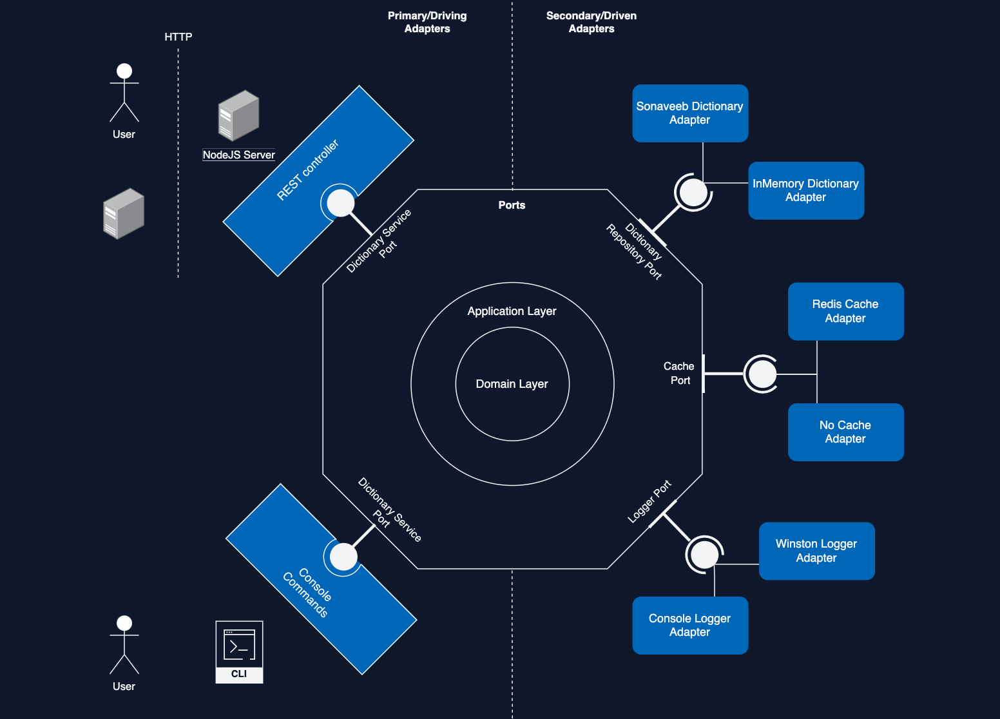

# SONAPI 🇪🇪 - An API for the Estonian language


* [Overview](#overview)
* [Installation and requirements](#installation-and-requirements)
* [Hexagonal architecture](#hexagonal-architecture)


## Overview

I am software developer based in Tallinn Estonia. While learning the estonian language I figured that there is no publicly available API for the language dictionary itself. The Estonian Language Institute provides a language portal called [Sonaveeb](https://sonaveeb.ee/) but no way to programmatically access the dictionary content.

[SONAPI](https://www.sonapi.ee/) is my side project and an API wrapper around to stay fit and get a deeper understanding of NodeJS, Typescript, design patterns and architectural concepts. This project is built with my interpretation of an API in a [Hexagonal Architecture](https://alistair.cockburn.us/hexagonal-architecture/) context. (Also called Ports & Adapters Architecture).

You can find a live example on https://www.sonapi.ee/ or just simply call [https://api.sonapi.ee/v1/{word}](https://api.sonapi.ee/v1/tubli) with whatever tool you like

## Installation and requirements

In order to run it locally you can either use [Docker](https://www.docker.com) with [Docker Compose](https://docs.docker.com/compose/) or run it in a local NodeJS environment.

### Docker

```
git clone https://github.com/BenediktGeiger/sonad-api.git
cd sonad-api
cp .env.docker .env
docker-compose up --build
```

| URL                                                              | Information                                            |
|------------------------------------------------------------------|--------------------------------------------------------|
| [http://localhost:8083/v1/{word}](http://localhost:8083/v1/tubli)| API Endpoint                                           |
| [http://localhost:9090/](http://localhost:9090/)                 | Prometheus instance to collect NodeJS and API metrics. |
| [http://localhost:3000/](http://localhost:3000/)                 | Grafana Dashboard                                      |


### Local NodeJS environment

```
git clone https://github.com/BenediktGeiger/sonad-api.git
cd sonad-api
cp .env.local .env
npm install
npm run dev
```

| URL                                                              | Information                                            |
|------------------------------------------------------------------|--------------------------------------------------------|
| [http://localhost:8083/v1/{word}](http://localhost:8083/v1/tubli)| API Endpoint                                           |


In order to enable rate-limiting and caching add a redis connection string to the REDIS environment variable.
```
DICTIONARY="sonaveeb"
LOGGER="winston"
PORT=8083
REDIS="127.0.0.1:6379"
```


## Hexagonal architecture

<h1 align="center">
  
</h1>

